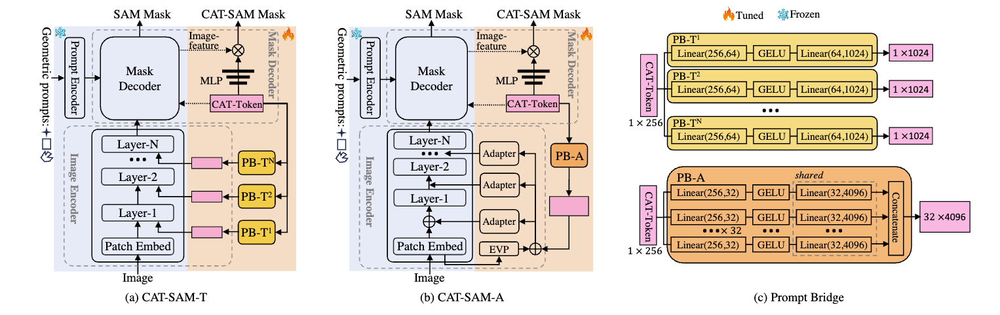

<h1 align="center">CAT-SAM: Conditional Tuning for Few-Shot Adaptation of Segment Anything Model
</h1>
<p align="center">
<a href="https://arxiv.org/abs/2402.03631" target='_blank'>
    
  </a><h5 align="center">
    <em>
        <a href="https://scholar.google.com/citations?user=yGKsEpAAAAAJ&hl=en">Aoran Xiao*</a>,
        <a href="https://scholar.google.com/citations?user=7e0W-2AAAAAJ&hl=en">Weihao Xuan*</a>,
        <a href="https://scholar.google.co.jp/citations?user=CH-rTXsAAAAJ&hl=en">Heli Qi</a>,
        <a href="https://scholar.google.co.jp/citations?user=uOAYTXoAAAAJ&hl=en">Yun Xing</a>,
        <a href="https://scholar.google.com/citations?user=ce-2e8EAAAAJ&hl">Ruijie Ren</a>,
        <a href="https://ieeexplore.ieee.org/author/37405025600">Xiaoqin Zhang</a>,
        <a href="https://scholar.google.com/citations?user=z84rLjoAAAAJ&hl=en">Ling Shao</a>,
        <a href="https://scholar.google.com/citations?user=uYmK-A0AAAAJ&hl=en">Shijian Lu^</a> 
       <br>(* indicates co-first authors with equal contributions. ^ indicates the corresponding author.)
    </em>
</h5><p align="center">

## About
The Segment Anything Model (SAM) has demonstrated remarkable zero-shot capability and flexible geometric prompting in general image segmentation. However, it often struggles in domains that are either sparsely represented or lie outside its training distribution, such as aerial, medical, and non-RGB images. Recent efforts have predominantly focused on adapting SAM to these domains using fully supervised methods, which necessitate large amounts of annotated training data and pose practical challenges in data collection. This paper presents CAT-SAM, a ConditionAl Tuning network that explores _few-shot adaptation_ of SAM toward various challenging downstream domains in a data-efficient manner. The core design is a _prompt bridge_ structure that enables _decoder-conditioned joint tuning_ of the heavyweight image encoder and the lightweight mask decoder. The bridging maps the domain-specific features of the mask decoder to the image encoder, fostering synergic adaptation of both components with mutual benefits with few-shot target samples only, ultimately leading to superior segmentation in various downstream tasks. We develop two CAT-SAM variants that adopt two tuning strategies for the image encoder: one injecting learnable prompt tokens in the input space and the other inserting lightweight adapter networks. Extensive experiments over 11 downstream tasks show that CAT-SAM achieves superior segmentation consistently even under the very challenging one-shot adaptation setup.


## News
- **(2024/9)** We updated the inference code to support customized model inference.
- **(2024/8)** CAT-SAM is selected as an :sparkles: Oral Paper :sparkles: at ECCV 2024!
- **(2024/7)** We released the training code. Thank you for your waiting!
- **(2024/7)** CAT-SAM is accepted by ECCV 2024! See you in Milano!


## Method


## Results
### 1-Shot Adaptation:
|      Methods      |  WHU  | Kvasir | SBU-Shadow | Average |
|:-----------------:|:-----:|:------:|:----------:|:-------:|
| **SAM (baseline)** | 43.5  |  79.0  |    62.4    |  61.6   |
| **VPT-shallow**    | 60.8  |  79.8  |    68.7    |  69.8   |
| **VPT-deep**       | 57.8  |  80.4  |    76.0    |  71.4   |
| **AdaptFormer**    | 83.2  |  76.8  |    77.2    |  79.1   |
| **LoRA**           | 86.1  |  77.5  |    74.4    |  79.3   |
| **CAT-SAM-T (Ours)** | 86.8 |  83.4  |    78.0    |  82.7   |
| **CAT-SAM-A (Ours)** | 88.2 |  85.4  |    81.9    |  85.2   |


## Installation
Please clone our project to your local machine and prepare our environment by the following commands:
```
$: cd cat-sam
$: conda create -n cat-sam python=3.9
$: conda activate cat-sam
$: python -m pip install -r requirements.txt
(cat-sam) $: python -m pip install -e .
```

The code has been tested on A100/A6000/V100 with Python 3.9, CUDA 11.7 and Pytorch 1.13.1. Any other devices and environments may require to update the code for compatibility.


## Data
Please refer to the README.md in the dataset-specific folders under `./data` to prepare each of them.

## Train
Before training, please download the SAM checkpoints to `./pretrained` from [here](https://github.com/facebookresearch/segment-anything#model-checkpoints).
After downloading, there should be:
```
cat-sam/
    pretrained/
        sam_vit_b_01ec64.pth
        sam_vit_h_4b8939.pth
        sam_vit_l_0b3195.pth
    ...
```

For one-shot training, please run:
```
$: cd cat-sam
$: pwd
/your_dir/cat-sam
$: conda activate cat-sam
(cat-sam) $: python train.py --dataset <your-target-dataset> --cat_type <your-target-type> --shot_num 1
```
Please prepare the following GPUs according to the following conditions:
1. `--dataset whu`: 1 x NVIDIA RTX A6000 (48GB) or ones with similar memories
2. `--dataset <other-than-whu>`: 1 x NVIDIA RTX A5000 (24GB) or ones with similar memories

After running, the checkpoint with the best performance will be automatically saved to `./exp/{dataset}_{sam_type}_{cat_type}_1shot`.
For the valid inputs for the arguments, please refer to the help message:
```
$: python train.py --help
```

For 16-shot and full-shot training, please run:
```
$: cd cat-sam
$: pwd
/your_dir/cat-sam
$: conda activate cat-sam
(cat-sam) $: CUDA_VISIBLE_DEVICES=0,1,2,3 python train.py --dataset <your-target-dataset> --cat_type <your-target-type> (--shot_num 16)
```
If the argument `--shot_num` is not specified, training will proceed with the full-shot condition. 
Please prepare the following GPUs according to the following conditions:
1. `--dataset whu`: 4 x NVIDIA RTX A6000 (48GB) or ones with similar memories
2. `--dataset <other-than-whu>`: 4 x NVIDIA RTX A5000 (24GB) or ones with similar memories


## Test

We provide the checkpoints for the 1-shot experiments.
To download the checkpoints, please visit [here](https://drive.google.com/drive/folders/1oik813aRkFvZh000GI_58TUsu1uW9LSF?usp=sharing).

For testing, please run:
```
$: cd cat-sam
$: pwd
/your_dir/cat-sam
$: conda activate cat-sam
(cat-sam) $: python test.py --dataset <your-target-dataset> --cat_type <your-target-type> --ckpt_path <your-target-ckpt>
```


## Inference
We provide user-friendly API for model inference using either PyTorch-alone APIs. 
Below is an example of conducting inference of CAT-SAM-A models on an image sample from the Kvasir dataset.
```python
import numpy as np
import torch
from PIL import Image

from cat_sam.models.modeling import CATSAMA

cat_sam_a = CATSAMA(model_type="vit_l")
ckpt = torch.load("{your cat-sam root}/pretrained/sbu_cat-a_vit-l_1shot.pth", map_location="cpu")
cat_sam_a.load_state_dict(ckpt["model"])
cat_sam_a = cat_sam_a.to("cuda")
cat_sam_a.eval()

rgb_image_path = "{your cat-sam root}/data/kvasir/TrainDataset/image/101.png"
rgb_image = Image.open(rgb_image_path).convert('RGB')
rgb_image = np.array(rgb_image, dtype=np.float32)
# (3, H, W) 0-255 torch.Tensor
rgb_image = torch.from_numpy(rgb_image).permute(2, 0, 1).cuda()
cat_sam_a.set_infer_img(img=rgb_image)

# 1. Inference by a bounding box
# (4,)
box_coords = torch.Tensor([160, 120, 280, 230]).cuda()
pred_masks = cat_sam_a.infer(box_coords=box_coords)
# (H, W) 0-1 torch.Tensor mask
pred_mask = pred_masks[0].squeeze()

# 2. Inference by a foreground point
# (1, 2)
point_coords = torch.Tensor([[200, 170]]).cuda()
pred_masks = cat_sam_a.infer(point_coords=point_coords)
# (H, W) 0-1 torch.Tensor mask
pred_mask = pred_masks[0].squeeze()
```
You can switch the model class to `CATSAMT` and pick up a corresponding checkpoint to conduct the same inference.

## Citation
If you find this work helpful, please kindly consider citing our paper:
```bibtex
@article{catsam,
  title={CAT-SAM: Conditional Tuning for Few-Shot Adaptation of Segment Anything Model},
  author={Xiao, Aoran and Xuan, Weihao and Qi, Heli and Xing, Yun and Ren, Ruijie and Zhang, Xiaoqin and Shao, Ling and Lu, Shijian},
  journal={arXiv preprint arXiv:2402.03631},
  year={2024}
}
```


## Acknowledgement
We acknowledge the use of the following public resources throughout this work: [Segment Anything Model](https://github.com/facebookresearch/segment-anything), [HQ-SAM](https://github.com/SysCV/sam-hq), [EVP](https://github.com/NiFangBaAGe/Explicit-Visual-Prompt) and [VPT](https://github.com/kmnp/vpt).
